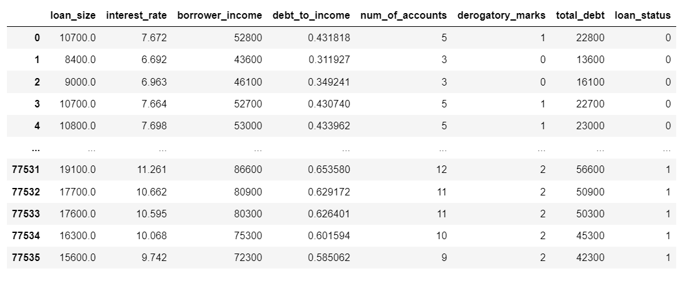

# Credit-Risk-Prediction Models

## Project Objective
Create a Machine learning model that attempts to predict whether a loan will be granted or not. 

## Project Goal
The purpose of this project is to create a supervised machine learning model and compare the overall model score of a LogisticRegression with the RandomForestClassifier. 

## Project Prediction
Prediction: The Logistic regression will be more accurate because the data is strictly quantitative and logistic regressions usually operate better under those conditions. Additionally, the data set does not have as many noise variables which will benefit the logisitic regression. On the contrary, given the amount of data, the scores between the two will be very close though.

### Step 1:
In order to create the models, there must be data. The data used has 8 quantitative columns with the last stating whether a loan would be given or not. 

### Step 2:
Once the data was pulled, the X and y variables need to be assigned. y was isolated for just the loan status column and X combined the other 7 elements. Once the data had been assigned, it was split into a training and testing set via the Scikit learn function of `train_test_split()`.

### Step 3:
Once the data had been split, the LogisticRegression function was used to create a classifier in order to run the `score()` function on both the training data and the test data. The model score for the Testing Data was .99246 and the score for the Training data was .99191.

### Step 4:

The next model used to compare the scores was the Random Forest Classifier (RFC). The function was also imported from Scikit and the `clf` classification allowed the RFC `score` to be calculated. The model score for the RFC Testing data was .99221 and the score for the Training data was .99719

## Results

It was extremely close but it appears the Logistic Regression Model tested better at .99246 vs the Random Forest Classifier score of .99221. Furthermore, the data was scaled in order to gain more understanding towards the RFC and, as expected, the training and testing scores were slightly lower at .96718 and .96945 respectively. The prediction stated earlier was correct by choosing the logistic regression model to have a better score and that the difference would be very small. It is also noteworthy how high each score was. This could be because because the credit risk variables are very specific and the data size is very large so the model has plenty of line items to develop accuracy.